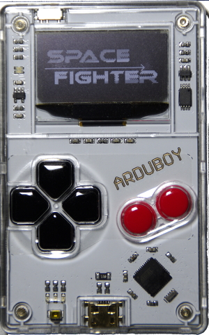
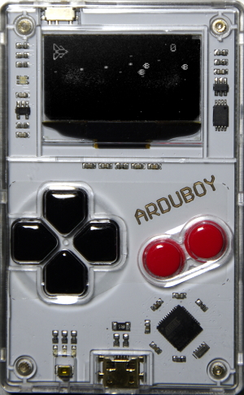

# SpaceFighter
All rights reserved. This file is free software; you can redistribute it and/or modify it under the terms of the GNU General Public License as published by the Free Software Foundation; either version 3 of the License, or (at your option) any later version.  This program is distributed in the hope that it will be useful, but WITHOUT ANY WARRANTY; without even the implied warranty of MERCHANTABILITY or FITNESS FOR A PARTICULAR PURPOSE. See the GNU General Public License for more details. You should have received a copy of the GNU General Public License along with this program. If not, see &lt;http://www.gnu.org/licenses/>  
This program is a game similar to R-Type. It is coded with Arduboy in mind. 

### Notes
This game has not been tested with the developer kit. A lot of memory is used.
In order to upload a new sketch, press the left button and the up button while
switching the arduboy on or else the upload will most likely fail.
This game is still in development and there are a lot of bugs and missing features
(see below). I am going to tackle the bugs first if feasible and then add features.

### Known bugs
* Explosions when the player dies are not drawn correctly.
* Explosions might occur when starting a new game.
* Collisions are calculated very poorly.
* Initials for the highscore are messed up.
* One ship is as fast as his bullets, therefore the bullet 'sticks' to the ship.
* The sketch uses a lot of RAM and prevents the Arduino IDE to upload new sketches without starting the Arduboy in safe mode.
* Player cannot shot. (Rarely)

### Missing features
* Ships only have limited movements.
* Only one kind of bullet is available.
* There are no upgrades for the ship.
* There are no levels or at least alternations of enemies. They just spawn randomly.
* There are no boss battles.
* There are no different backgrounds.
* There is no sound but there actually is no sound in space. I suppose it still counts as a missing feature.
* The pace of the game needs calibration.

### Screenshots

